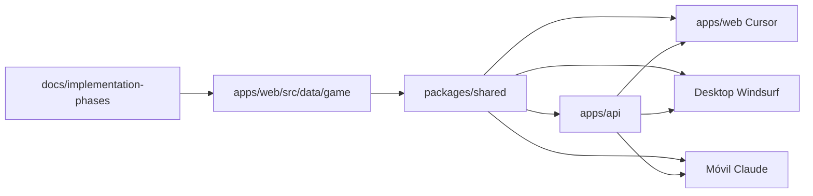

# Coordinación Web + Desktop + Móvil

**Directorio canónico:** `c:\temp-galaxy\`  
**Infra compartida:** Railway (API + Web) + Supabase (Postgres / Storage)  
**Regla:** Si no está en esta carpeta o en `docs/implementation-phases/`, no entra en ningún cliente.

---

## Roles

| Agente | Plataforma | Carpeta de trabajo | Gráfica |
|--------|------------|-------------------|---------|
| **Cursor** | Web (navegador) | `apps/web/` | 2D / 2.5D isométrico, assets ligeros |
| **Windsurf** | Desktop (PC) | `client-pc/` o rama acordada en repo | 3D completo, HD |
| **Claude** (después) | Móvil | `client-mobile/` (crear cuando toque) | UI táctil, misma lógica |

Los tres son **clientes del mismo backend**. No duplicar economía, combate ni colas en el front.

---

## Fuente de verdad (orden de lectura)

1. `docs/implementation-phases/README.md` — índice por fases  
2. `docs/implementation-phases/ARCHITECTURE/unified-architecture.md` — backend único  
3. `docs/implementation-phases/ARCHITECTURE/common-api-documentation.md` — contrato API  
4. `docs/implementation-phases/ARCHITECTURE/web-client-specifications.md` — **Cursor**  
5. `docs/implementation-phases/ARCHITECTURE/pc-client-specifications.md` — **Windsurf**  
6. `docs/SINGLE_SOURCE_OF_TRUTH.md` — recursos, items, nombres oficiales  
7. `apps/web/src/data/game/` — datos de juego ya modelados (edificios, naves, economía, etc.)

---

## Qué reutilizar de Railway / Supabase

| Recurso | Uso |
|---------|-----|
| Repo GitHub `galaxyonlineiii` | Deploy Railway (no cambiar sin acuerdo) |
| API producción | `https://galaxyonlineiii-production.up.railway.app` |
| Web producción | `https://galaxy-web-production.up.railway.app` |
| `DATABASE_URL` | Postgres (Supabase o Neon — el del proyecto Railway) |
| `NEXT_PUBLIC_SUPABASE_URL` + bucket | GLB / assets en Storage |

Variables en `.env.example` (raíz del monorepo).

---

## Qué NO usar (desalineado)

- Trabajo solo en `Documents\Codex\GALAXY ONLINE III` si contradice `temp-galaxy` (Nova Imperium paralelo, mocks, catálogos distintos).  
- Lógica de juego solo en un cliente (ej. construcción solo en web mock).  
- Nombres de recursos distintos por plataforma (`PLASMA` en API y `HE3` en UI sin mapeo documentado).

---

## Contrato mínimo compartido (Fase 1)

### Pantallas (misma navegación lógica)

- Planeta / base terrestre (grilla + construcción GO II)  
- Mapa galaxia  
- Estación espacial  
- Mercado  
- Flotas (formación 9×9 en Fase 2)  
- Astillero / investigación (según doc)

### Mecánica construcción (doc `1-2-buildings-construction.md`)

- Menú **5 pestañas:** Recursos, Desarrollo, Civil, Milicia, Defensa  
- Límite **n/m** por tipo en planeta  
- Cola **5 slots** (servidor)  
- Grilla jugador **10×8** (80 slots) en planeta medium  
- `constructionEndsAt` desde API  

### Datos

- Catálogo: `apps/web/src/data/game/buildings-complete.ts` (12 edificios, niveles 1–20)  
- Planetas: `planet-colonization.ts`  
- Economía: `economy-system.ts`  

**Próximo paso técnico:** mover tipos y constantes a `packages/shared` para que API y los 3 clientes importen lo mismo.

---

## Flujo de trabajo entre agentes

1. Cambio de diseño → actualizar `.md` en `docs/` primero.  
2. Cambio de balance → `buildings-complete.ts` / economía + migración API.  
3. Cursor implementa UI web contra API real.  
4. Windsurf replica pantallas en 3D sin cambiar reglas.  
5. Claude replica en móvil cuando API esté estable.

---

## Cursor — arranque web (ahora)

Ver `docs/PLAN_ARRANQUE_WEB_CURSOR.md`.

Prioridad: Fase 1 alineada al video GO II (planeta isométrico, HUD 4 recursos, martillo, cola derecha), datos de `buildings-complete`, API Railway.

---

## Windsurf — desktop

Seguir `pc-client-specifications.md`. Mismas rutas API y mismos DTO que web. Assets en `assets/` y Storage.

---

## Claude — móvil (más adelante)

Seguir `docs/SHARED_DOCUMENTATION_SYSTEM.md` → `CLIENT_INTEGRATION/mobile_integration.md` cuando exista. Hasta entonces: no implementar rutas móviles nativas; solo documentar dependencias de API.

---

## Checklist “mismo juego”

- [ ] Login/registro mismo JWT  
- [ ] `GET /api/game/dashboard` igual en web y desktop  
- [ ] Mismos tipos de edificio en API que en `buildings-complete`  
- [ ] Cola de construcción visible con mismos nombres y tiempos  
- [ ] Recursos: metal, plasma/he3, créditos, energía (según doc economía)  
- [ ] Misma grilla 10×8 y slotIndex 0–79  

---

*Última actualización: reinicio coordinado multi-agente.*
